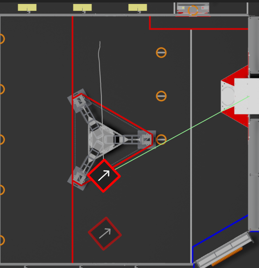

+++
title = "Charlie's First Post"
date = 2024-10-01T21:54:00-04:00
author = 'Charlie'
+++

## Greetings
Hello Honzik! I'm excited to make a website with you. To match your code snippet, I've included an image with a robot:

<!-- {{ $image := .Resources.Get "robot.png" }} -->
<!--  -->

I hope we do amazing things with this site.